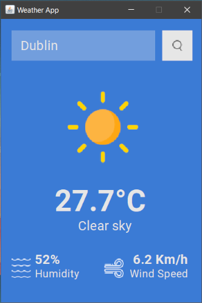

# Simple Weather App

This simple weather app retrieves current weather data for any location using the openweathermap.org API.

## Usage
To use the app, you'll need an API key from *openweathermap.org*:
- Sign up and obtain a free API key [here](https://openweathermap.org/current).
- Rename the `config.properties.sample` file to `config.properties`.
- Open the `config.properties` file and replace `YOUR_API_KEY_HERE` with your actual API key

Run command:
```
mvn exec:java
```
## Demo



## Notes
- Requires Maven installed.
- NO input validation is done, it's a simple app as I was focused more on the implementation side.
- API used: https://openweathermap.org/current.
